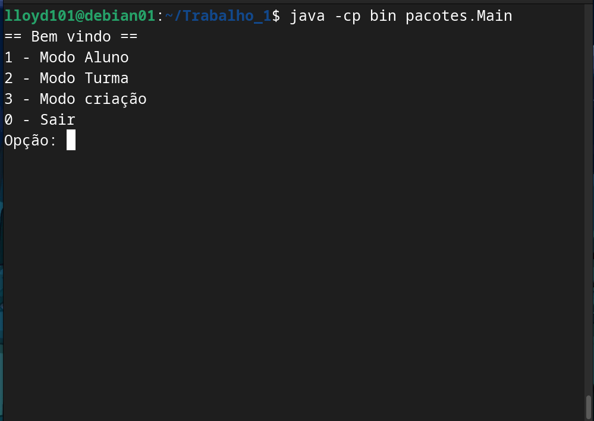

Sistema Acadêmico - FCTE
Descrição do Projeto

Desenvolvimento de um sistema acadêmico para gerenciar alunos, disciplinas, professores, turmas, avaliações e frequência, utilizando os conceitos de orientação a objetos (herança, polimorfismo e encapsulamento) e persistência de dados em arquivos.

O enunciado do trabalho pode ser encontrado aqui:

    Trabalho 1 - Sistema Acadêmico

Dados do Aluno

    Nome completo: Daniel Lustosa Miranda
    Matrícula: 242015808
    Curso: Engenharias
    Turma: [Preencher aqui]

Instruções para Compilação e Execução

    Compilação:
    Entre na pasta Trabalho_1
    Para copilar rode os dois:

    find src -name "*.java" > sources.txt
    javac -d bin @sources.txt
    java -cp bin pacotes.Main

    Execução:
    Dentro da pasta trabalho execute:
    java -cp bin pacotes.Main

    Estrutura de Pastas:

Trabalho 1

    Versão do JAVA utilizada:
    Java 21

Vídeo de Demonstração

    [Inserir o link para o vídeo no YouTube/Drive aqui]

Prints da Execução

    Menu Principal:

    Cadastro de Aluno:

Principais Funcionalidades Implementadas

    Cadastro, listagem de alunos e turmas, matrícula.

    Cadastro de disciplinas e criação de turmas (presenciais e remotas)
    Matrícula de alunos em turmas,
    Persistência de dados em arquivos (.txt ou .csv)
    Uso de herança, polimorfismo e encapsulamento

Observações (Extras ou Dificuldades)

    As dificulades que tive foi em relação a sintaxe do java, implemetar as funcionalidades utilizando os arquivos e conseguir fazer com que as classes interagissem corretamente. 
    Seria interessante ter algumas aulas para praticar mais.

Contato

    danillusto59@gmail.com